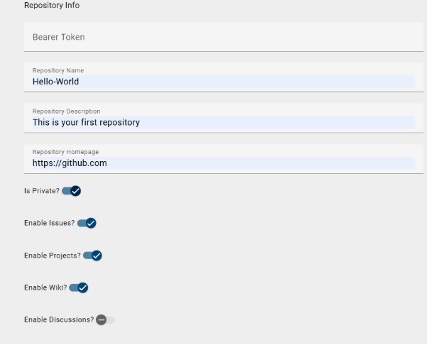
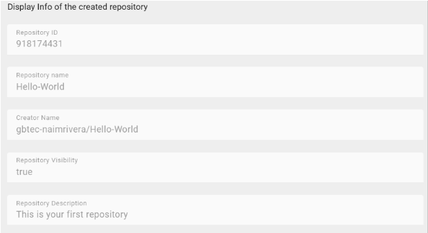
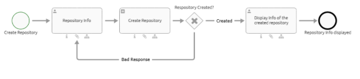

# **GIT HUB INTEGRATION**

# Create a repository for the authenticated user

In this example, we will describe the steps to **create a repository** for a GitHub user using its REST API integrated with **BIC software** by simply completing a Form.

## **Configuration**

These are the necessary accounts to set-up the request.

**it is necessary to have:**

* **A GitHub Account**  
* **BIC Design and Execution Account**

## 

## **GitHub Authentication**

In this integration, a GitHub API token is needed for authentication. To create an API token for GitHub, follow these steps:

1. **Log in** to your GitHub account.   
2. Click on your profile picture or initials in the top right corner of the screen, and select **settings**  
3. Scroll down and click on **Developer settings**  
4. Generate a **fine-grained token**(Personal access tokens), the  fine-grained token must have the following permission set: "**Administration**" repository permissions (write).

				

## **Create the repository**

In order to create the repository once we got the token, **we only need to fill the form** with the information needed in Process Execution.

  

When the repository is created, **Process Execution might display basic information** about the repository.

  

Once this action is completed, **if the repository is not created correctly, the form can be filled again until the repository is created**. 

## 

## **Diagram**

If you want to **change** **some of the default repository attributes**, you just need to access the form **“Repository Info” and modify the default values**. On the right side.

This a close look to the diagram  
…

* **“Repository info”** is used to receive and store in variables the repository info, it as a user task.  
* **“Create repository”** creates the repository using a Programmable Task with JavaScript  
* **“Repository Created?”** automatically  falls back to step 1 if the repository is not created correctly.  
* **“Display Info of the created repository”** uses a form to display basic information of the repository

  
This is the diagram

  

